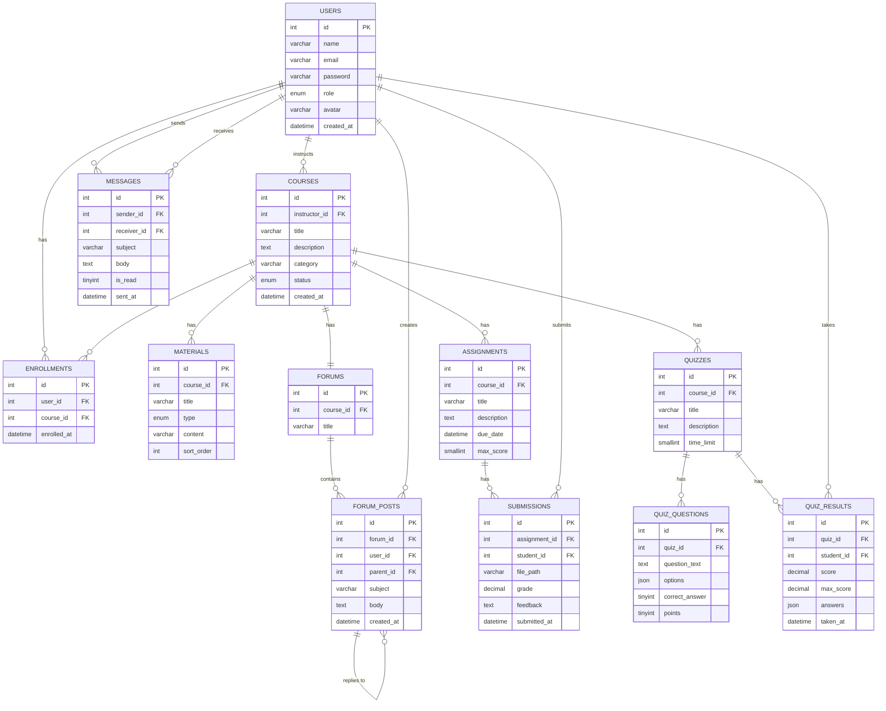
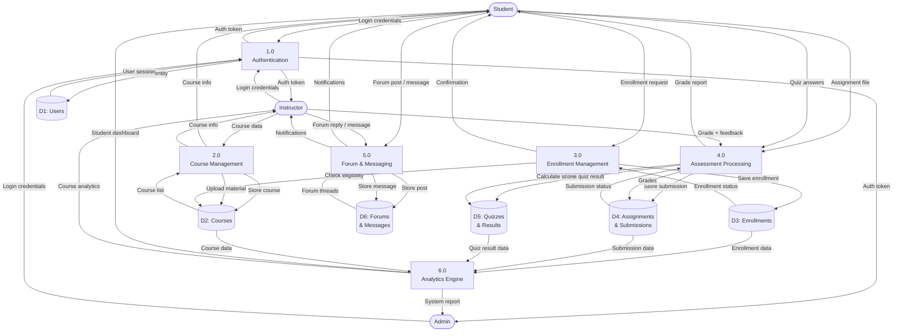

# LMS - System Diagrams

## ERD (Entity-Relationship Diagram)

```mermaid
erDiagram
    USERS {
        int id PK
        varchar name
        varchar email
        varchar password
        enum role
        varchar avatar
        datetime created_at
    }
    COURSES {
        int id PK
        int instructor_id FK
        varchar title
        text description
        varchar category
        enum status
        datetime created_at
    }
    ENROLLMENTS {
        int id PK
        int user_id FK
        int course_id FK
        datetime enrolled_at
    }
    MATERIALS {
        int id PK
        int course_id FK
        varchar title
        enum type
        varchar content
        int sort_order
    }
    FORUMS {
        int id PK
        int course_id FK
        varchar title
    }
    FORUM_POSTS {
        int id PK
        int forum_id FK
        int user_id FK
        int parent_id FK
        varchar subject
        text body
        datetime created_at
    }
    MESSAGES {
        int id PK
        int sender_id FK
        int receiver_id FK
        varchar subject
        text body
        tinyint is_read
        datetime sent_at
    }
    ASSIGNMENTS {
        int id PK
        int course_id FK
        varchar title
        text description
        datetime due_date
        smallint max_score
    }
    SUBMISSIONS {
        int id PK
        int assignment_id FK
        int student_id FK
        varchar file_path
        decimal grade
        text feedback
        datetime submitted_at
    }
    QUIZZES {
        int id PK
        int course_id FK
        varchar title
        text description
        smallint time_limit
    }
    QUIZ_QUESTIONS {
        int id PK
        int quiz_id FK
        text question_text
        json options
        tinyint correct_answer
        tinyint points
    }
    QUIZ_RESULTS {
        int id PK
        int quiz_id FK
        int student_id FK
        decimal score
        decimal max_score
        json answers
        datetime taken_at
    }

    USERS ||--o{ COURSES : "instructs"
    USERS ||--o{ ENROLLMENTS : "has"
    COURSES ||--o{ ENROLLMENTS : "has"
    COURSES ||--o{ MATERIALS : "has"
    COURSES ||--|| FORUMS : "has"
    FORUMS ||--o{ FORUM_POSTS : "contains"
    USERS ||--o{ FORUM_POSTS : "creates"
    FORUM_POSTS ||--o{ FORUM_POSTS : "replies to"
    USERS ||--o{ MESSAGES : "sends"
    USERS ||--o{ MESSAGES : "receives"
    COURSES ||--o{ ASSIGNMENTS : "has"
    ASSIGNMENTS ||--o{ SUBMISSIONS : "has"
    USERS ||--o{ SUBMISSIONS : "submits"
    COURSES ||--o{ QUIZZES : "has"
    QUIZZES ||--o{ QUIZ_QUESTIONS : "has"
    QUIZZES ||--o{ QUIZ_RESULTS : "has"
    USERS ||--o{ QUIZ_RESULTS : "takes"
```

---

## Use Case Diagram

```mermaid
graph TB
    subgraph Actors
            S([Student])
                    I([Instructor])
                            A([Admin])
                                end

                                    subgraph "Course Management"
                                            UC1[Browse Courses]
                                                    UC2[Enroll in Course]
                                                            UC3[View Course Materials]
                                                                    UC4[Create Course]
                                                                            UC5[Edit Course]
                                                                                    UC6[Delete Course]
                                                                                            UC7[Upload Materials]
                                                                                                    UC8[Manage Enrollments]
                                                                                                        end

                                                                                                            subgraph "Assessment"
                                                                                                                    UC9[Submit Assignment]
                                                                                                                            UC10[View Grades]
                                                                                                                                    UC11[Take Quiz]
                                                                                                                                            UC12[Create Assignment]
                                                                                                                                                    UC13[Grade Submission]
                                                                                                                                                            UC14[Create Quiz]
                                                                                                                                                                    UC15[View Quiz Results]
                                                                                                                                                                        end

                                                                                                                                                                            subgraph "Communication"
                                                                                                                                                                                    UC16[Post in Forum]
                                                                                                                                                                                            UC17[Reply to Post]
                                                                                                                                                                                                    UC18[Send Message]
                                                                                                                                                                                                            UC19[Read Messages]
                                                                                                                                                                                                                end

                                                                                                                                                                                                                    subgraph "Analytics"
                                                                                                                                                                                                                            UC20[View Progress Dashboard]
                                                                                                                                                                                                                                    UC21[View Course Analytics]
                                                                                                                                                                                                                                            UC22[Manage Users]
                                                                                                                                                                                                                                                    UC23[System Overview]
                                                                                                                                                                                                                                                        end

                                                                                                                                                                                                                                                            S --> UC1
                                                                                                                                                                                                                                                                S --> UC2
                                                                                                                                                                                                                                                                    S --> UC3
                                                                                                                                                                                                                                                                        S --> UC9
                                                                                                                                                                                                                                                                            S --> UC10
                                                                                                                                                                                                                                                                                S --> UC11
                                                                                                                                                                                                                                                                                    S --> UC16
                                                                                                                                                                                                                                                                                        S --> UC17
                                                                                                                                                                                                                                                                                            S --> UC18
                                                                                                                                                                                                                                                                                                S --> UC19
                                                                                                                                                                                                                                                                                                    S --> UC20

                                                                                                                                                                                                                                                                                                        I --> UC1
                                                                                                                                                                                                                                                                                                            I --> UC3
                                                                                                                                                                                                                                                                                                                I --> UC4
                                                                                                                                                                                                                                                                                                                    I --> UC5
                                                                                                                                                                                                                                                                                                                        I --> UC6
                                                                                                                                                                                                                                                                                                                            I --> UC7
                                                                                                                                                                                                                                                                                                                                I --> UC8
                                                                                                                                                                                                                                                                                                                                    I --> UC12
                                                                                                                                                                                                                                                                                                                                        I --> UC13
                                                                                                                                                                                                                                                                                                                                            I --> UC14
                                                                                                                                                                                                                                                                                                                                                I --> UC15
                                                                                                                                                                                                                                                                                                                                                    I --> UC16
                                                                                                                                                                                                                                                                                                                                                        I --> UC17
                                                                                                                                                                                                                                                                                                                                                            I --> UC18
                                                                                                                                                                                                                                                                                                                                                                I --> UC19
                                                                                                                                                                                                                                                                                                                                                                    I --> UC21

                                                                                                                                                                                                                                                                                                                                                                        A --> UC22
                                                                                                                                                                                                                                                                                                                                                                            A --> UC23
                                                                                                                                                                                                                                                                                                                                                                                A --> UC1
                                                                                                                                                                                                                                                                                                                                                                                    A --> UC21
```

---

## DFD Level 1 (Data Flow Diagram)

```mermaid
flowchart TD
    %% External Entities
    ST([Student])
    IN([Instructor])
    AD([Admin])

    %% Processes
    P1[1.0\nAuthentication]
    P2[2.0\nCourse Management]
    P3[3.0\nEnrollment Management]
    P4[4.0\nAssessment Processing]
    P5[5.0\nForum & Messaging]
    P6[6.0\nAnalytics Engine]

    %% Data Stores
    DS1[(D1: Users)]
    DS2[(D2: Courses)]
    DS3[(D3: Enrollments)]
    DS4[(D4: Assignments\n& Submissions)]
    DS5[(D5: Quizzes\n& Results)]
    DS6[(D6: Forums\n& Messages)]

    %% Authentication flows
    ST -->|Login credentials| P1
    IN -->|Login credentials| P1
    AD -->|Login credentials| P1
    P1 -->|Verify identity| DS1
    DS1 -->|User session| P1
    P1 -->|Auth token| ST
    P1 -->|Auth token| IN
    P1 -->|Auth token| AD

    %% Course management
    IN -->|Course data| P2
    P2 -->|Store course| DS2
    P2 -->|Upload material| DS2
    DS2 -->|Course list| P2
    P2 -->|Course info| ST
    P2 -->|Course info| IN

    %% Enrollment
    ST -->|Enrollment request| P3
    P3 -->|Check eligibility| DS2
    P3 -->|Save enrollment| DS3
    DS3 -->|Enrollment status| P3
    P3 -->|Confirmation| ST

    %% Assessment
    ST -->|Assignment file| P4
    ST -->|Quiz answers| P4
    P4 -->|Store submission| DS4
    P4 -->|Store quiz result| DS5
    P4 -->|Calculate score| DS5
    IN -->|Grade + feedback| P4
    P4 -->|Grades| DS4
    DS4 -->|Submission status| P4
    P4 -->|Grade report| ST

    %% Forum & Messaging
    ST -->|Forum post / message| P5
    IN -->|Forum reply / message| P5
    P5 -->|Store post| DS6
    P5 -->|Store message| DS6
    DS6 -->|Forum threads| P5
    P5 -->|Notifications| ST
    P5 -->|Notifications| IN

    %% Analytics
    DS3 -->|Enrollment data| P6
    DS4 -->|Submission data| P6
    DS5 -->|Quiz result data| P6
    DS2 -->|Course data| P6
    P6 -->|Student dashboard| ST
    P6 -->|Course analytics| IN
    P6 -->|System report| AD
```
